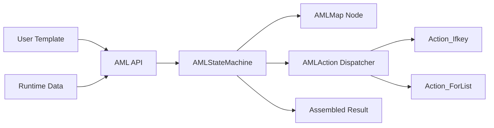
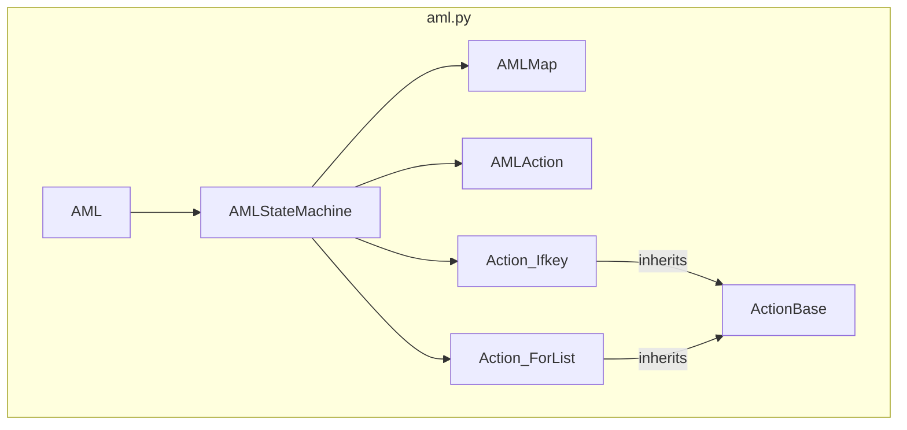
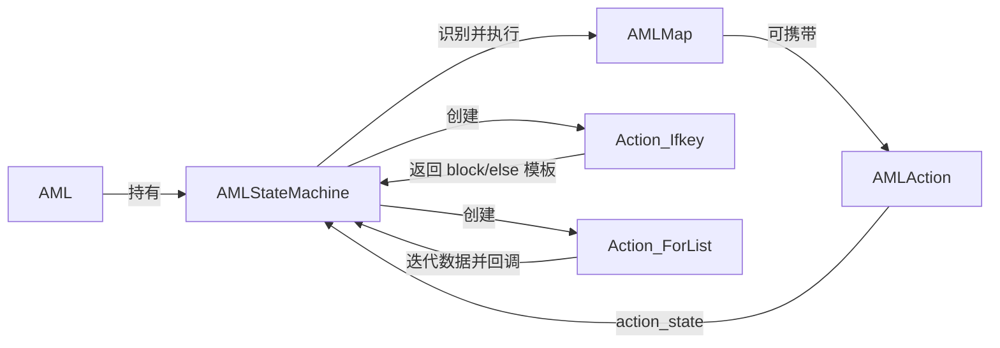
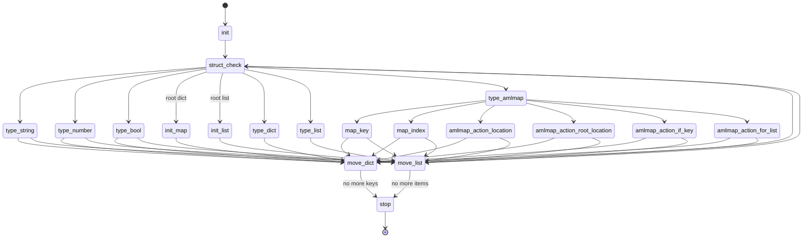
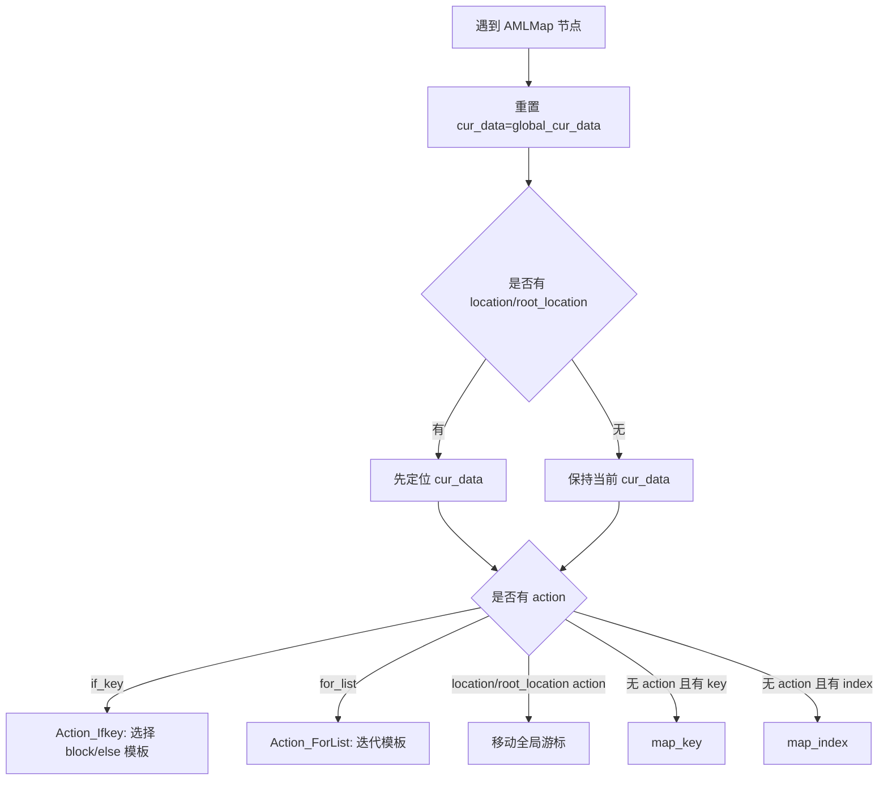
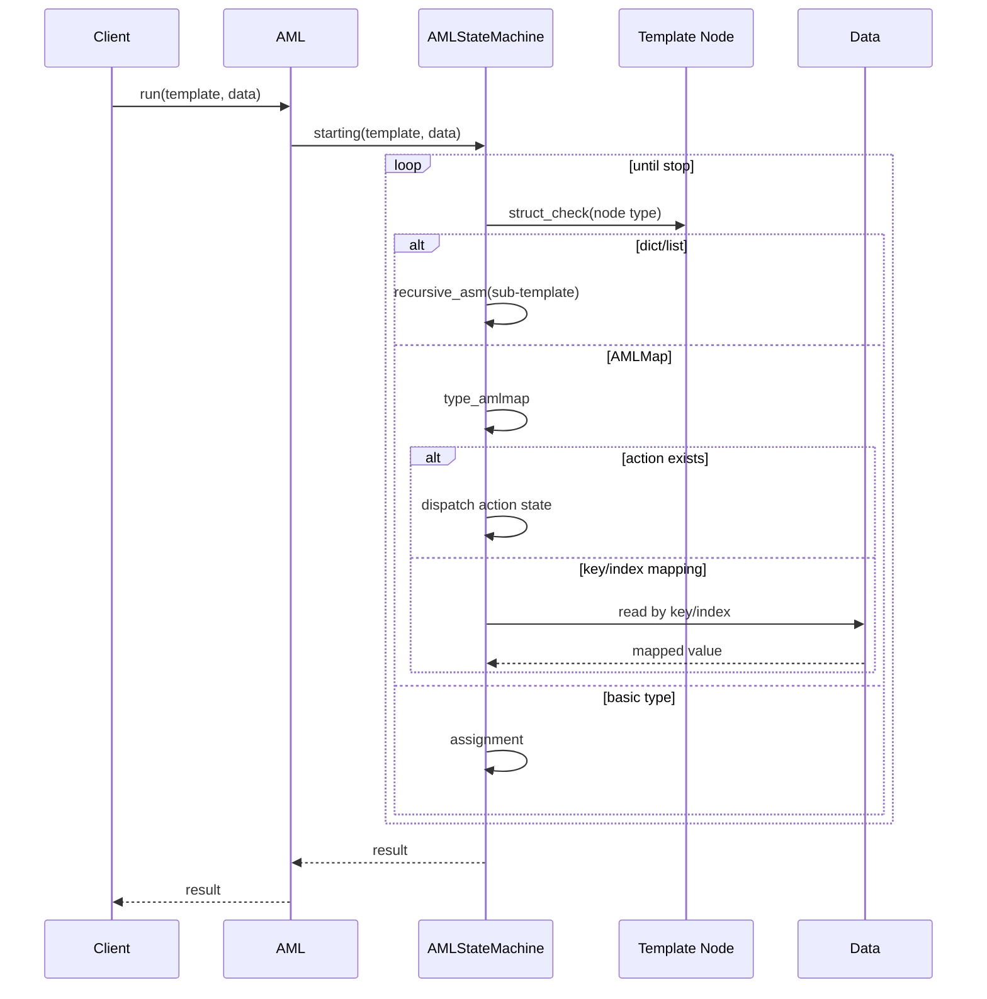
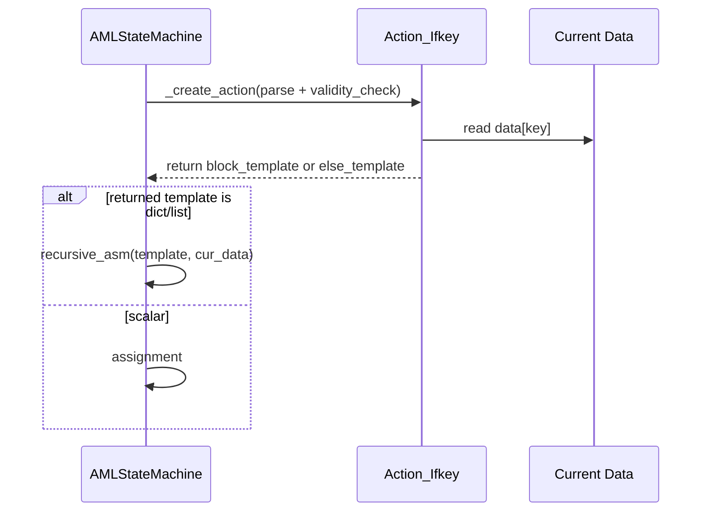
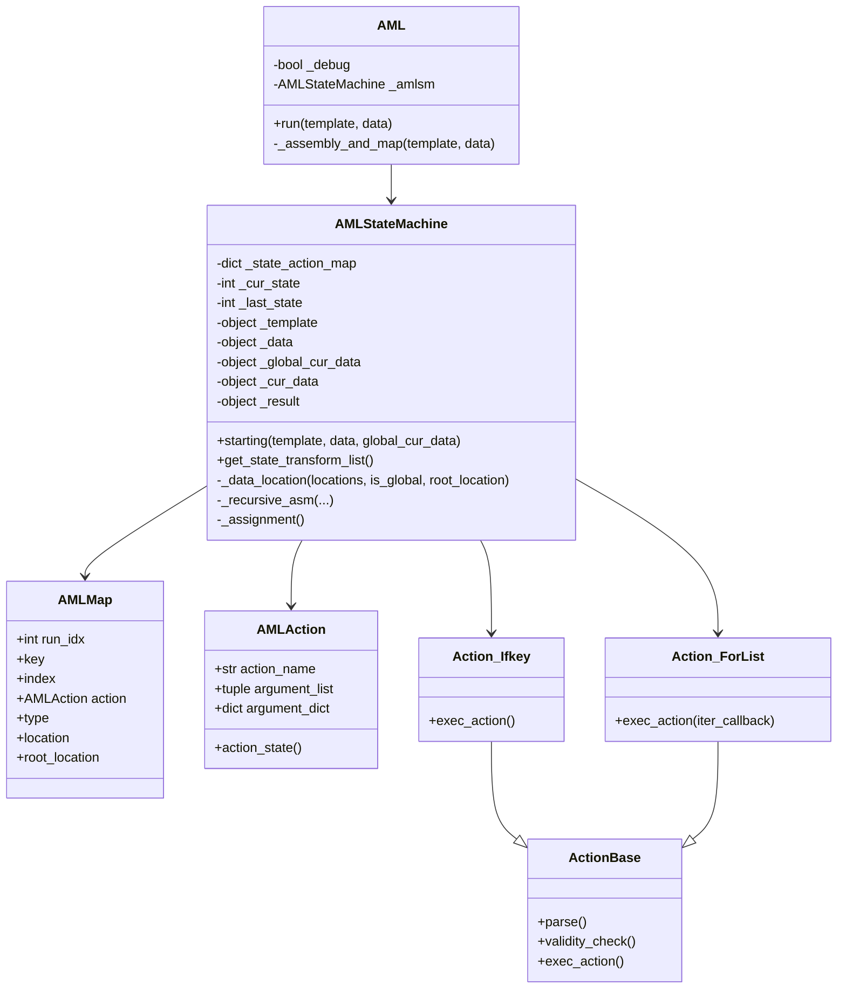
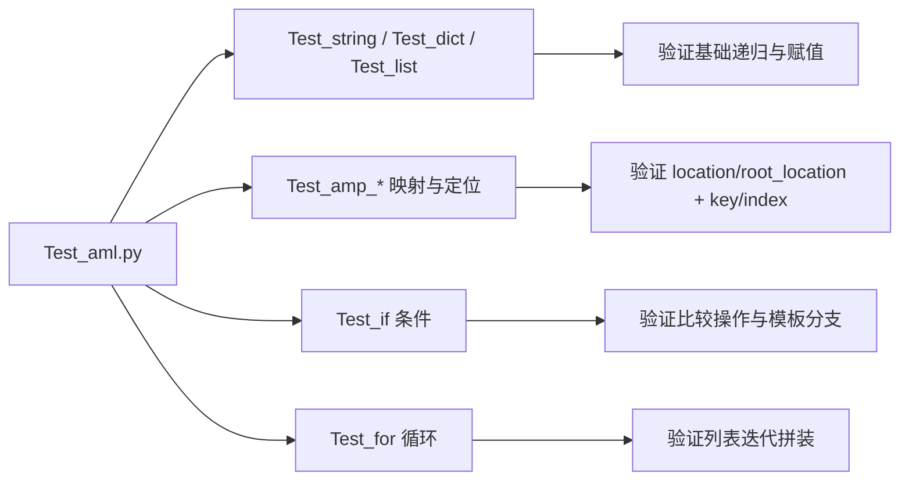

# AML 项目全面分析（架构 + 功能 + 图表）

## 1. 项目定位与目标

AML（Assembly & Map Language）是一个**模板驱动的数据组装与映射引擎**：输入 `template + data`，输出按模板组装后的结果。核心由状态机执行模板遍历与映射动作，支持条件分支和列表循环。

- 核心表达式：`result = template + data`
- 入口类：`AML`
- 核心执行器：`AMLStateMachine`
- 模板节点描述：`AMLMap`
- 可执行动作：`AMLAction`（`location`/`root_location`/`if_key`/`for_list`）

---

## 2. 代码结构分析

当前仓库非常精简，主要由单文件实现与测试文件构成：

- `aml.py`：核心引擎实现（状态机、映射规则、动作系统、入口 API）
- `Test_aml.py`：覆盖字符串、字典、列表、location/root_location、if_key、for_list 等场景
- `README.md`：极简项目描述

### 2.1 模块分层（逻辑层次）

```mermaid
flowchart TB
    A[调用方业务代码] --> B[AML.run(template, data)]
    B --> C[AML._assembly_and_map]
    C --> D[AMLStateMachine.starting]

    D --> E{节点类型判定}
    E -->|基础类型| F[直接赋值]
    E -->|dict/list| G[递归子状态机]
    E -->|AMLMap| H[执行映射或动作]

    H --> I[map_key / map_index]
    H --> J[action: location/root_location]
    H --> K[action: if_key]
    H --> L[action: for_list]

    K --> D
    L --> D
```

---

## 3. 架构分析

### 3.1 总体架构图（系统视角）



### 3.2 组件图（实现视角）



### 3.3 组件关系图（依赖/职责）



---

## 4. 状态机设计分析

### 4.1 状态类别

- 基础状态：`init / stop / init_map / init_list / move_dict / move_list`
- 结构判定状态：`struct_check` 及 string/number/bool/list/dict/amlmap 分支
- 映射状态：`map_key / map_index`
- 动作状态：`amlmap_action_location / root_location / if_key / for_list`

### 4.2 状态流程图（核心）



---

## 5. 功能分析

### 5.1 已支持能力

1. **基础透传**：模板是字符串/数字/布尔时，直接写入结果。
2. **复杂结构递归**：支持 dict/list 嵌套结构递归组装。
3. **字段映射**：
   - `AMLMap(key=...)` 从字典按 key 取值
   - `AMLMap(index=...)` 从列表按 index 取值
   - `type=` 支持取值后转换（如 `int/str`）
4. **数据游标切换**：
   - `location`：基于当前全局游标移动
   - `root_location`：从根数据重新定位
5. **条件分支（if_key）**：支持 `==, >=, >, <=, <, !=` 比较并返回 block/else 子模板。
6. **列表迭代（for_list）**：对 list 数据逐项套用子模板，结果累积为列表。
7. **执行顺序控制**：基于 `AMLMap.run_idx` 与 `MAP_order_cache` 保证 map 执行顺序。

### 5.2 典型处理流程图（一个 AMLMap 节点）



---

## 6. 时序图

### 6.1 主流程时序图（run -> state machine）



### 6.2 `if_key` 动作时序图



---

## 7. 类图



---

## 8. 测试覆盖分析

### 8.1 已覆盖场景

- 基础类型：字符串、字典、列表、字典+列表混合
- `location` 与 `root_location` 导航
- `key/index` 映射与 `type` 转换
- `if_key` 条件分支
- `for_list` 列表循环

### 8.2 测试流程图



---

## 9. 优势、风险与改进建议

### 9.1 优势

- 设计简洁：单文件状态机可快速理解。
- 表达力强：模板可声明式定义映射、条件与循环。
- 易于扩展：动作体系（`AMLAction` + `ActionBase`）支持新增动作。

### 9.2 风险/技术债

1. **Python2 语法依赖**：`basestring`、`long`、`is not 0` 等写法在 Python3 存在兼容性问题。
2. **错误处理偏 assert/logging**：运行时异常边界不够清晰。
3. **可读性与可维护性**：状态较多且集中在单类，后续扩展复杂度会增加。
4. **测试组织较旧**：函数命名与 pytest 约定不完全一致（`Test_*` 而非 `test_*`），自动化发现能力弱。

### 9.3 建议演进路径

- **短期**：
  - 补齐 Python3 兼容层（`str` 判定、`int` 统一、`!=` 替代 `is not`）。
  - 将测试改为 `pytest` 规范命名，接入 CI。
- **中期**：
  - 拆分 `aml.py`：`state_machine.py`、`actions.py`、`models.py`。
  - 把状态定义改为 `Enum`，增加状态转移表可视化导出。
- **长期**：
  - 引入 DSL schema 校验和静态检查。
  - 增加性能基准（大模板、多层嵌套、批量数据）。

---

## 10. 一句话总结

AML 是一个“**模板驱动 + 状态机执行 + 动作扩展**”的数据组装引擎，适合将复杂业务数据映射成统一输出结构；当前核心功能完整，但在 Python3 兼容、可维护性和工程化方面仍有较大优化空间。
